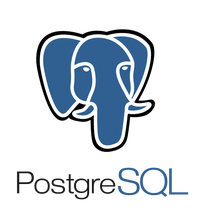

# 
* Здесь представлены три работы по PostgreSQL. [Первая](HW_SQL.sql) включает в себя работу с созданием, изменением, наполнением данными, удалением таблиц. [Вторая](HW2_SQL.sql) включает в себя работу с данными из таблиц. [Третья](HW3_SQL.sql) включает в себя работу с объединением таблиц с помощью JOIN, с группировкой данных с помощью команды GROUP BY и сортировкой данных с помощью ORDER BY.